<p align="center">
  <picture>
    <source media="(prefers-color-scheme: dark)" srcset="docs/readme/banner-dark.svg">
    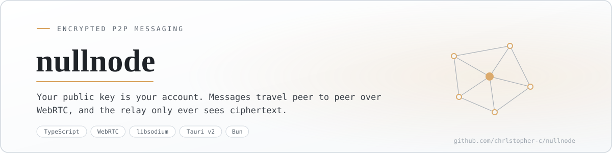
  </picture>
</p>

<p align="center"><sub>English · <a href="#version-française">Version française</a></sub></p>

# nullnode

Encrypted messaging where your public key is your account. No sign-up, no phone number, no directory, no password to recover. Messages travel peer to peer over WebRTC, and the only server in the picture is a relay you host yourself, which never sees anything but sealed bytes.

> Status: working prototype, in a browser and as a desktop app. Identity, friends, encrypted conversations, backups and the desktop daemon all work. Two peers on different networks still need a STUN server, which is deliberately not wired yet. Last active June 2026.

<p align="center">
  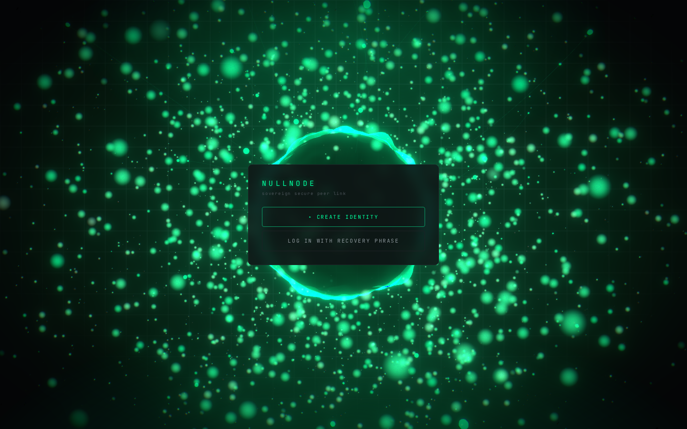
</p>
<p align="center"><sub>The way in: create an identity, or bring one back from its twelve words. There is no third option, and that is the point.</sub></p>

## What it does

- Derives your identity from twelve BIP39 words generated on your device, so the same words always rebuild the same account and nobody else can reissue it.
- Gives you an address (`null:` plus your public key), a three-word callsign and a `PSEUDO#0000` handle, all derived from the key itself.
- Encrypts your twelve words at rest behind a PIN, using Argon2 rather than a plain hash.
- Sends friend requests through the relay, sealed, and stores them until the other side comes back online.
- Opens a direct WebRTC channel per conversation, encrypted with ChaCha20-Poly1305 under keys derived per session.
- Shows four words on both sides so you can check by voice that nobody sits in the middle.
- Backs up your roster and history as a blob the relay stores but cannot open, and exports the same blob to a file.
- Keeps several accounts on one device, each in its own storage namespace.
- Holds your presence from a small Rust daemon on desktop when the window is closed.

## How it works

<p align="center">
  <picture>
    <source media="(prefers-color-scheme: dark)" srcset="docs/readme/how-it-works-dark.svg">
    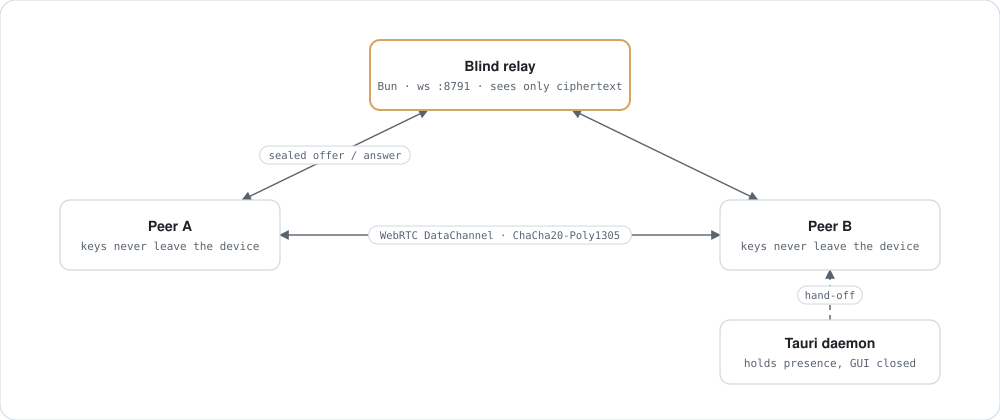
  </picture>
</p>

A sends a WebRTC offer sealed to B's public key. The relay routes those bytes without being able to open them, B answers the same way, and once the channel is up the relay is out of the conversation entirely. If one side is offline the sealed envelope waits, capped in size and expiring after a week.

## The cryptography

<p align="center">
  <picture>
    <source media="(prefers-color-scheme: dark)" srcset="docs/readme/crypto-dark.svg">
    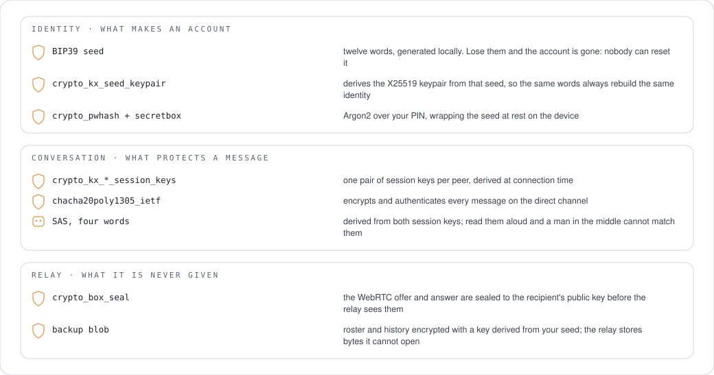
  </picture>
</p>

What the relay does see, and I would rather say it plainly: which addresses are online, and who sends a sealed blob to whom. That is a social graph and it is real metadata. What it never sees is any content: not a message, not a signalling payload, not a backup. Running your own relay is the answer to the first part, which is why hosting one is four lines of setup.

## Use

<p align="center">
  <picture>
    <source media="(prefers-color-scheme: dark)" srcset="docs/readme/usage-dark.svg">
    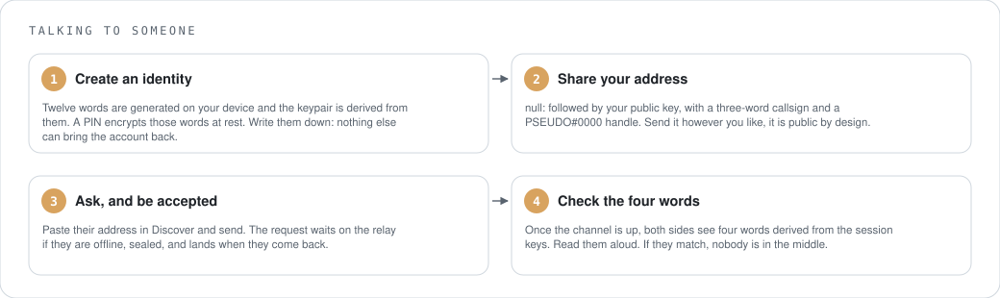
  </picture>
</p>

<table>
<tr>
<td width="50%">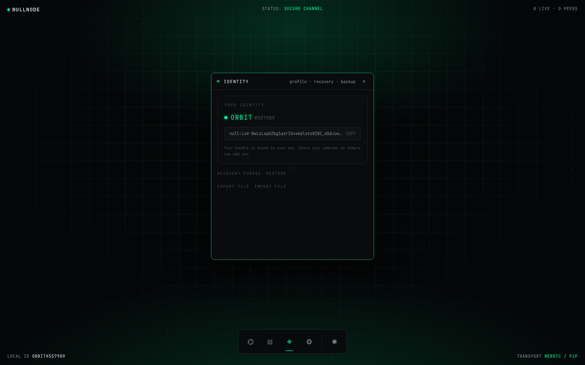</td>
<td width="50%">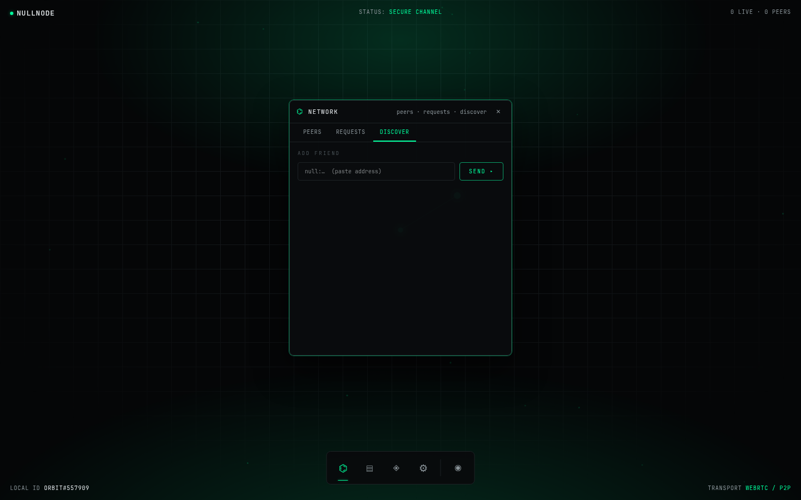</td>
</tr>
<tr>
<td><sub>Your account is a key. The handle and the callsign are derived from it, so nothing here was assigned to you by a server.</sub></td>
<td><sub>Adding someone means pasting their address. There is no directory to search, by design.</sub></td>
</tr>
</table>

## Install

<p align="center">
  <picture>
    <source media="(prefers-color-scheme: dark)" srcset="docs/readme/install-dark.svg">
    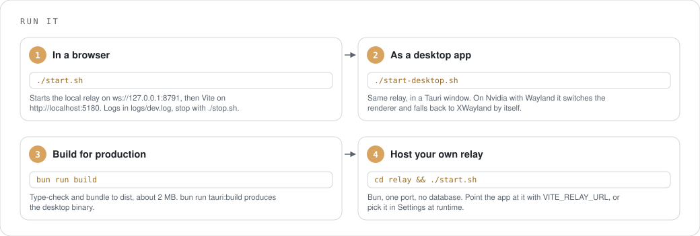
  </picture>
</p>

```sh
bun install
./start.sh              # relay on ws://127.0.0.1:8791, app on http://localhost:5180
./start-desktop.sh      # the same thing in a Tauri window
./stop.sh               # or ./stop-desktop.sh
```

To try a real conversation, open the app in two different browsers, create an identity in each, paste one address into the other's Discover field, accept, and talk. Two profiles of the same browser will not do: one origin means one storage, and therefore one identity.

Your own relay, on a Pi or a small VPS:

```sh
cd relay && ./start.sh                     # RELAY_PORT to move it off 8791
VITE_RELAY_URL=wss://relay.example ./start.sh   # or pick it in Settings at runtime
```

## Where things live

<p align="center">
  <picture>
    <source media="(prefers-color-scheme: dark)" srcset="docs/readme/files-dark.svg">
    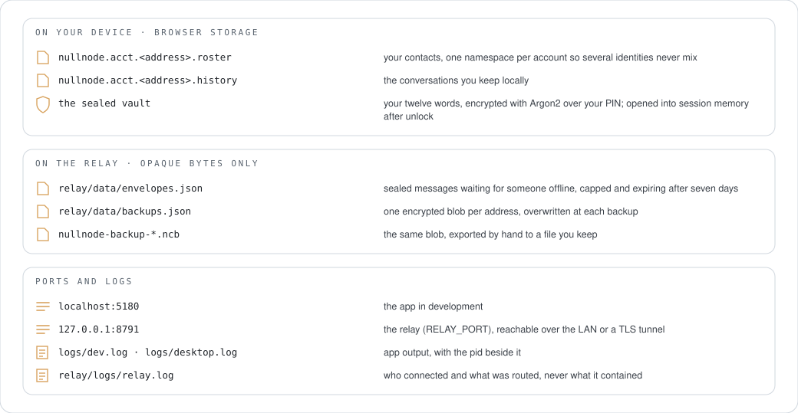
  </picture>
</p>

## Erase yourself

<p align="center">
  <picture>
    <source media="(prefers-color-scheme: dark)" srcset="docs/readme/uninstall-dark.svg">
    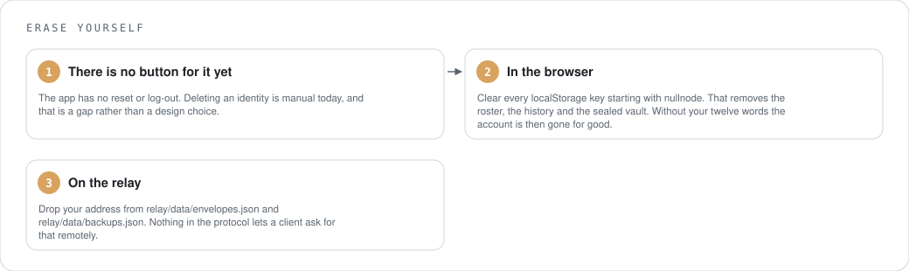
  </picture>
</p>

## Counted

<p align="center">
  <picture>
    <source media="(prefers-color-scheme: dark)" srcset="docs/readme/counted-dark.svg">
    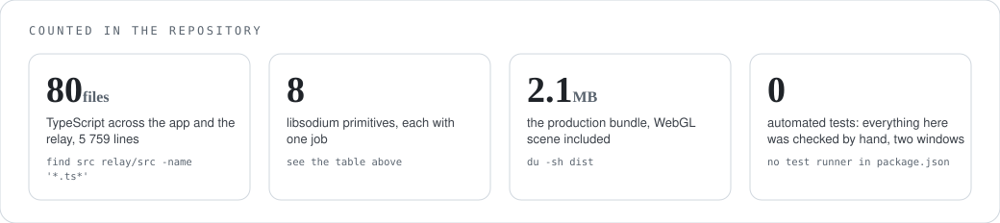
  </picture>
</p>

## What it stands on

<p align="center">
  <picture>
    <source media="(prefers-color-scheme: dark)" srcset="docs/readme/deps-dark.svg">
    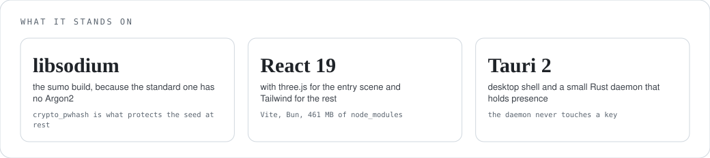
  </picture>
</p>

## Help

| Symptom | Cause | Fix |
|---|---|---|
| Blank window on the desktop app (Nvidia, Wayland) | WebKitGTK's DMABUF renderer fails on that stack | `start-desktop.sh` already switches the renderer and falls back to XWayland; use the script rather than `tauri dev` |
| No 3D scene on the desktop app | deliberate fallback to a static background when WebGL is unreliable there | nothing to fix |
| Two peers on different networks never connect | there is no STUN or TURN server, so direct connections only work on one network | keep both on a LAN, or add a STUN server in the transport config |
| A message is sent but never arrives | the other side is offline, so it is waiting sealed on the relay | it lands when they reconnect, unless it aged past a week |
| Port 8791 is taken | another service uses the relay's default | `RELAY_PORT=... ./relay/start.sh`, then point `VITE_RELAY_URL` at it |
| The desktop daemon drops when you open the window | the relay keeps one socket per address, so the window takes over and the daemon returns when you close it | expected |
| Two identities in one browser | one origin means one storage | use two different browsers, not two profiles |

## Where it stands

Working: identity and recovery, the PIN vault, the blind relay with presence and store-and-forward, friend requests, encrypted conversations with several peers at once, the four-word check, zero-knowledge backup and file export, multiple accounts, and the desktop daemon.

Missing, and I would rather list it than let you find out: there is no STUN or TURN, so two peers behind different NATs fall back to store-and-forward instead of talking directly. There is no delete button, so removing an identity means clearing storage by hand. There is no automated test suite either: every check was done with two browser windows, which is exactly the kind of validation that stops scaling right when it matters. The manual dead-drop fallback was removed in June, so the relay is now a hard dependency for rendezvous.

## Project docs

`ARCHITECTURE.md`, `RENDEZVOUS-PROTOCOL.md` (what the relay is allowed to know, written before the code), `STATE.md`, `TODO.md`, `ARBORESCENCE.md`.

## Licence

No licence file yet.

---

## Version française

Une messagerie chiffrée où ta clé publique est ton compte. Pas d'inscription, pas de numéro de téléphone, pas d'annuaire, pas de mot de passe à récupérer. Les messages passent en pair à pair par WebRTC, et le seul serveur de l'histoire est un relai que tu héberges toi-même, qui ne voit jamais que des octets scellés.

> État : prototype qui marche, dans un navigateur et en application de bureau. L'identité, les amis, les conversations chiffrées, les sauvegardes et le daemon de bureau fonctionnent. Deux pairs sur des réseaux différents ont encore besoin d'un serveur STUN, délibérément non branché. Dernière activité : juin 2026.

<p align="center">
  
</p>
<p align="center"><sub>L'entrée : créer une identité, ou la ramener depuis ses douze mots. Il n'y a pas de troisième option, et c'est le principe.</sub></p>

### Ce que ça fait

- Dérive ton identité de douze mots BIP39 générés sur ton appareil, si bien que les mêmes mots reconstruisent toujours le même compte et que personne d'autre ne peut le réémettre.
- Te donne une adresse (`null:` suivi de ta clé publique), un indicatif de trois mots et un identifiant `PSEUDO#0000`, tous dérivés de la clé elle-même.
- Chiffre tes douze mots au repos derrière un code, avec Argon2 plutôt qu'un simple hachage.
- Envoie les demandes d'ami par le relai, scellées, et les garde jusqu'au retour en ligne du destinataire.
- Ouvre un canal WebRTC direct par conversation, chiffré en ChaCha20-Poly1305 sous des clés dérivées par session.
- Affiche quatre mots des deux côtés pour vérifier de vive voix que personne n'est au milieu.
- Sauvegarde ton carnet et ton historique en un blob que le relai stocke sans pouvoir l'ouvrir, et exporte le même blob dans un fichier.
- Tient plusieurs comptes sur un même appareil, chacun dans son espace de stockage.
- Maintient ta présence depuis un petit daemon Rust sur le bureau quand la fenêtre est fermée.

### Comment ça marche

<p align="center">
  <picture>
    <source media="(prefers-color-scheme: dark)" srcset="docs/readme/how-it-works-dark.svg">
    
  </picture>
</p>

A envoie une offre WebRTC scellée vers la clé publique de B. Le relai route ces octets sans pouvoir les ouvrir, B répond de la même façon, et une fois le canal établi le relai sort complètement de la conversation. Si l'un des deux est hors ligne, l'enveloppe scellée attend, bornée en taille et expirée au bout d'une semaine.

### La cryptographie

<p align="center">
  <picture>
    <source media="(prefers-color-scheme: dark)" srcset="docs/readme/crypto-dark.svg">
    
  </picture>
</p>

Ce que le relai voit, et autant le dire franchement : quelles adresses sont en ligne, et qui envoie un blob scellé à qui. C'est un graphe social, et c'est de la vraie métadonnée. Ce qu'il ne voit jamais, c'est le moindre contenu : ni un message, ni une charge de signalisation, ni une sauvegarde. Héberger son propre relai répond à la première partie, et c'est pour ça que le monter tient en quatre lignes.

### Utilisation

<p align="center">
  <picture>
    <source media="(prefers-color-scheme: dark)" srcset="docs/readme/usage-dark.svg">
    
  </picture>
</p>

<table>
<tr>
<td width="50%"></td>
<td width="50%"></td>
</tr>
<tr>
<td><sub>Ton compte est une clé. L'identifiant et l'indicatif en sont dérivés, donc rien ici ne t'a été attribué par un serveur.</sub></td>
<td><sub>Ajouter quelqu'un, c'est coller son adresse. Il n'y a pas d'annuaire où chercher, volontairement.</sub></td>
</tr>
</table>

### Installation

<p align="center">
  <picture>
    <source media="(prefers-color-scheme: dark)" srcset="docs/readme/install-dark.svg">
    
  </picture>
</p>

```sh
bun install
./start.sh              # relai sur ws://127.0.0.1:8791, app sur http://localhost:5180
./start-desktop.sh      # la même chose dans une fenêtre Tauri
./stop.sh               # ou ./stop-desktop.sh
```

Pour essayer une vraie conversation, ouvre l'app dans deux navigateurs différents, crée une identité dans chacun, colle l'adresse de l'un dans le champ Discover de l'autre, accepte, et parle. Deux profils du même navigateur ne suffisent pas : une origine, un stockage, donc une identité.

Ton propre relai, sur un Pi ou un petit VPS :

```sh
cd relay && ./start.sh                     # RELAY_PORT pour le sortir du 8791
VITE_RELAY_URL=wss://relai.exemple ./start.sh   # ou choisis-le dans les Réglages à l'exécution
```

### Où sont les choses

<p align="center">
  <picture>
    <source media="(prefers-color-scheme: dark)" srcset="docs/readme/files-dark.svg">
    
  </picture>
</p>

### S'effacer

<p align="center">
  <picture>
    <source media="(prefers-color-scheme: dark)" srcset="docs/readme/uninstall-dark.svg">
    
  </picture>
</p>

### Compté

<p align="center">
  <picture>
    <source media="(prefers-color-scheme: dark)" srcset="docs/readme/counted-dark.svg">
    
  </picture>
</p>

### Sur quoi ça repose

<p align="center">
  <picture>
    <source media="(prefers-color-scheme: dark)" srcset="docs/readme/deps-dark.svg">
    
  </picture>
</p>

### Aide

| Symptôme | Cause | Remède |
|---|---|---|
| Fenêtre blanche en application de bureau (Nvidia, Wayland) | le renderer DMABUF de WebKitGTK échoue sur cette pile | `start-desktop.sh` bascule déjà le renderer et se replie sur XWayland ; passe par le script plutôt que par `tauri dev` |
| Pas de scène 3D sur le bureau | repli volontaire vers un fond statique quand WebGL n'est pas fiable là-dessus | rien à corriger |
| Deux pairs sur des réseaux différents ne se connectent jamais | il n'y a ni STUN ni TURN, donc le direct ne marche que sur un même réseau | garde les deux sur un LAN, ou ajoute un serveur STUN dans la configuration du transport |
| Un message part mais n'arrive jamais | l'autre est hors ligne, le message attend scellé sur le relai | il arrive à la reconnexion, sauf s'il a dépassé une semaine |
| Le port 8791 est pris | un autre service occupe le défaut du relai | `RELAY_PORT=... ./relay/start.sh`, puis pointe `VITE_RELAY_URL` dessus |
| Le daemon de bureau lâche quand tu ouvres la fenêtre | le relai ne garde qu'une socket par adresse, la fenêtre prend la main et le daemon revient à la fermeture | comportement attendu |
| Deux identités dans un même navigateur | une origine, un stockage | utilise deux navigateurs différents, pas deux profils |

### Où ça en est

Fonctionne : l'identité et la récupération, le coffre à code, le relai aveugle avec présence et store-and-forward, les demandes d'ami, les conversations chiffrées avec plusieurs pairs à la fois, la vérification des quatre mots, la sauvegarde à connaissance nulle et l'export fichier, le multi-compte, et le daemon de bureau.

Ce qui manque, et autant l'écrire plutôt que te le laisser découvrir : il n'y a ni STUN ni TURN, donc deux pairs derrière des NAT différents retombent sur le store-and-forward au lieu de se parler directement. Il n'y a pas de bouton d'effacement, donc supprimer une identité veut dire vider le stockage à la main. Il n'y a pas non plus de suite de tests automatisés : chaque vérification s'est faite avec deux fenêtres de navigateur, exactement le genre de validation qui cesse de tenir au moment où ça compte. Le repli manuel par dead-drop a été retiré en juin, donc le relai est désormais une dépendance dure pour le rendez-vous.

### Documentation du projet

`ARCHITECTURE.md`, `RENDEZVOUS-PROTOCOL.md` (ce que le relai a le droit de savoir, écrit avant le code), `STATE.md`, `TODO.md`, `ARBORESCENCE.md`.

### Licence

Pas encore de fichier de licence.
